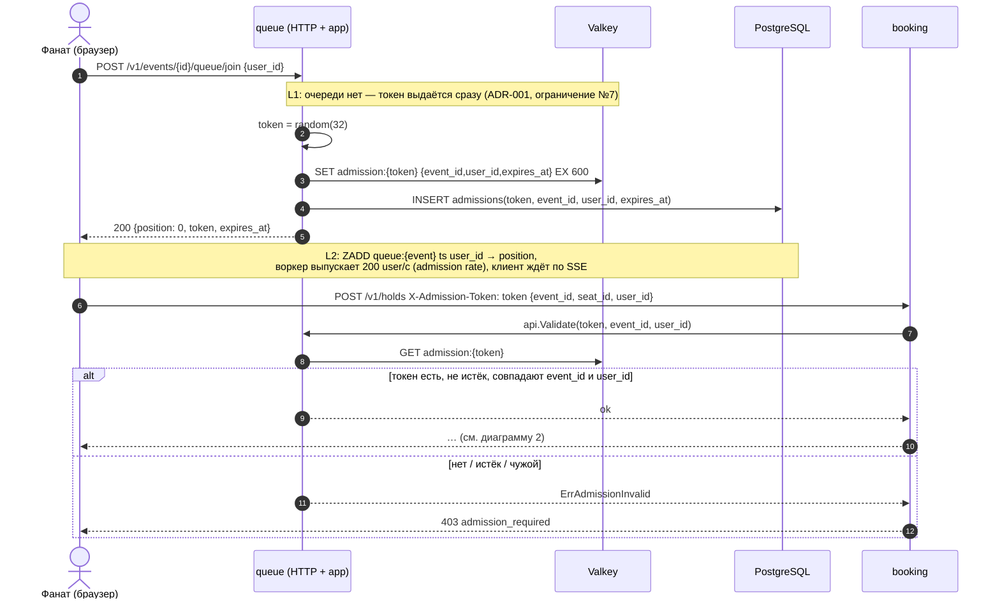
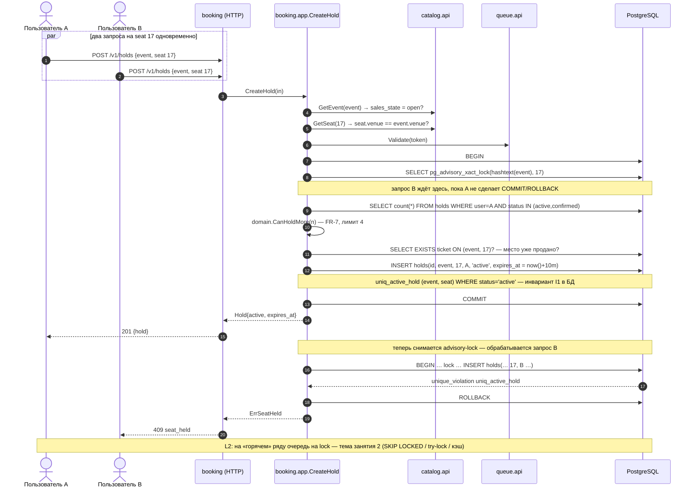
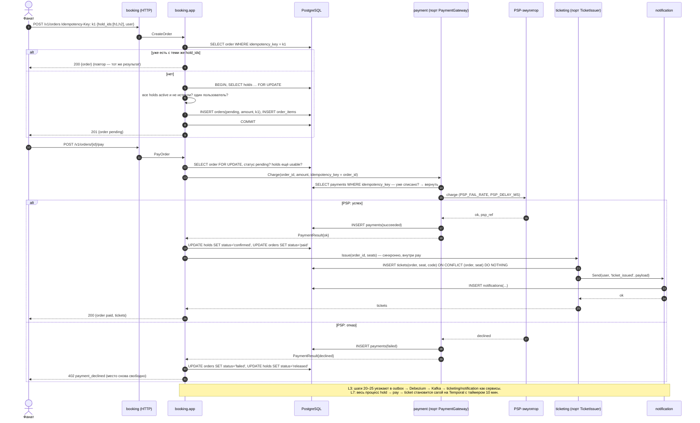
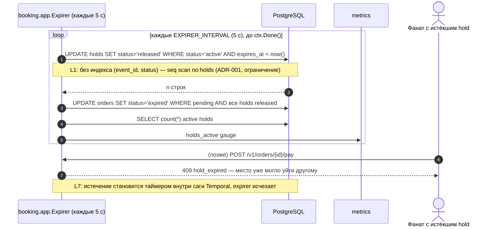
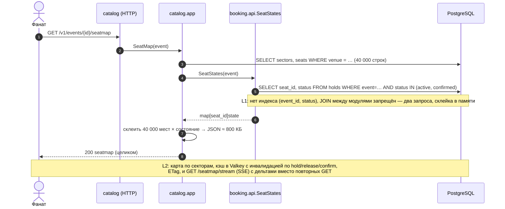

# `soldout`: sequence-диаграммы ключевых процессов (состояние `lesson-1`)

Пять процессов, которые надо понимать, чтобы читать код `internal/booking`, `internal/queue`, `internal/payment`, `internal/ticketing`. Участники соответствуют модулям; стрелки между модулями идут **только через пакеты `api`** (правило зависимостей из constitution). Пометки «L1» — как сейчас; «L2/L3/L7» — что изменится на следующих занятиях.

## 1. Waiting room: очередь и admission-токен

Зачем: ограничить поток в консистентную часть системы (admission rate), сделать обход очереди невозможным (токен проверяется на сервере, привязан к `user_id` и `event_id`, живёт ограниченное время).

## 2. Hold: удержание места и инвариант I1 (два конкурента на одно место)

Зачем: показать, где именно живёт «ноль двойных продаж» — в транзакции с advisory-lock и partial unique index, а не в проверке `if`.

## 3. Заказ и оплата: order → pay → ticket → notification (L1 — всё синхронно)

Зачем: увидеть идемпотентность (`Idempotency-Key`), порты `PaymentGateway`/`TicketIssuer`, и то, почему `pay` на L1 медленный и хрупкий — это мотивация занятия 3 (outbox, события).

## 4. Истечение hold: expirer (фоновая горутина)

Зачем: место, удержанное и не оплаченное, должно вернуться в продажу без участия клиента.

## 5. Карта зала: как клиент видит статусы мест

Зачем: понять, что карта — проекция `catalog` + `booking` (через `booking.api.SeatStates`), и почему на L1 это самый тяжёлый запрос.

