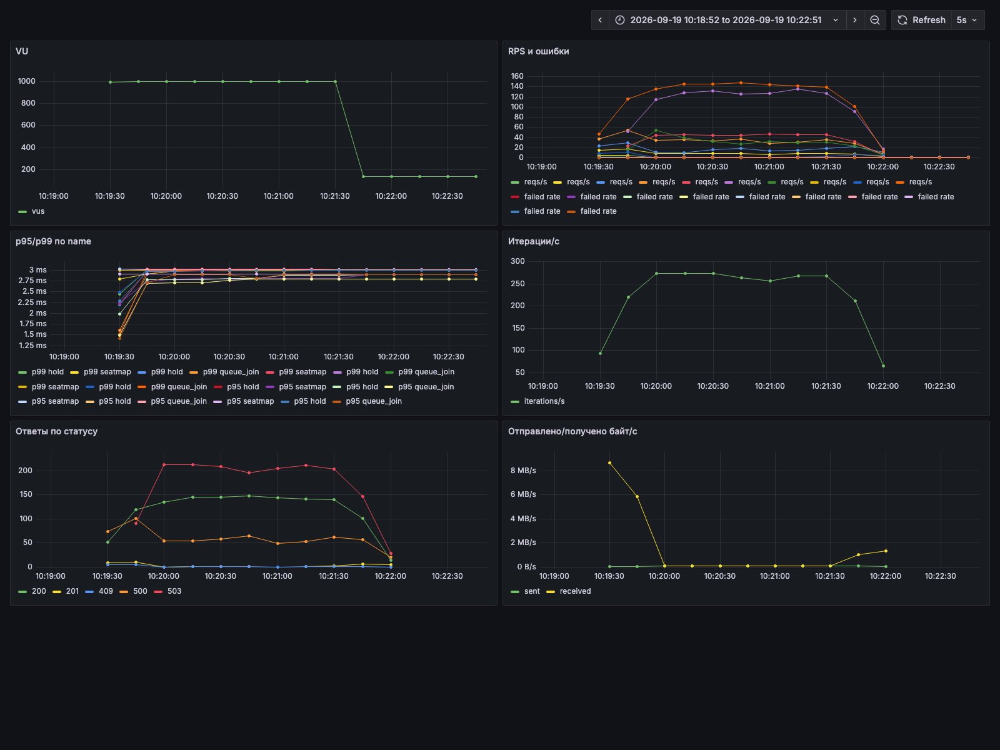
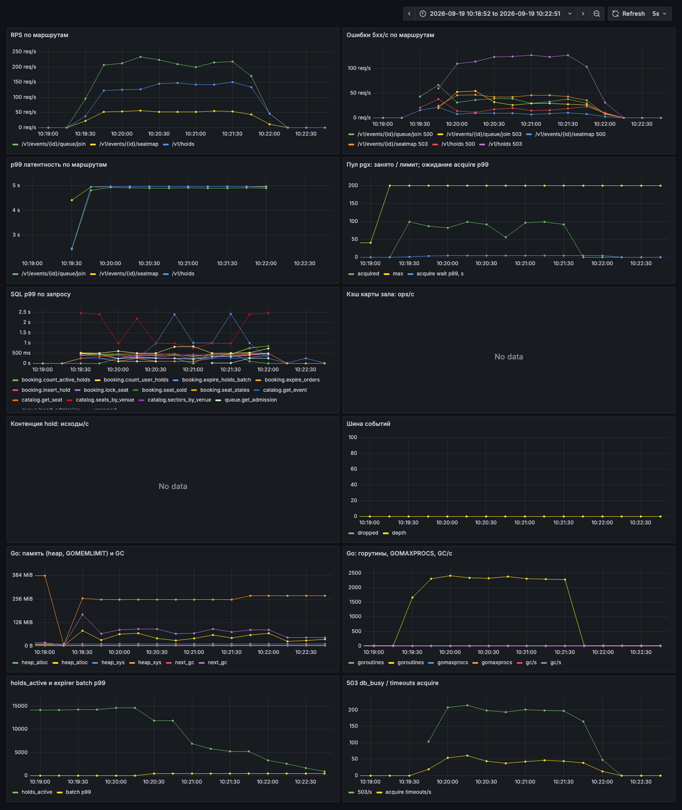
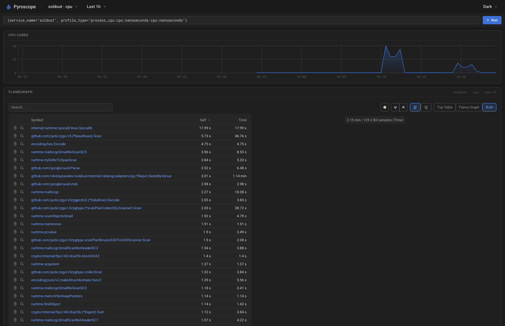
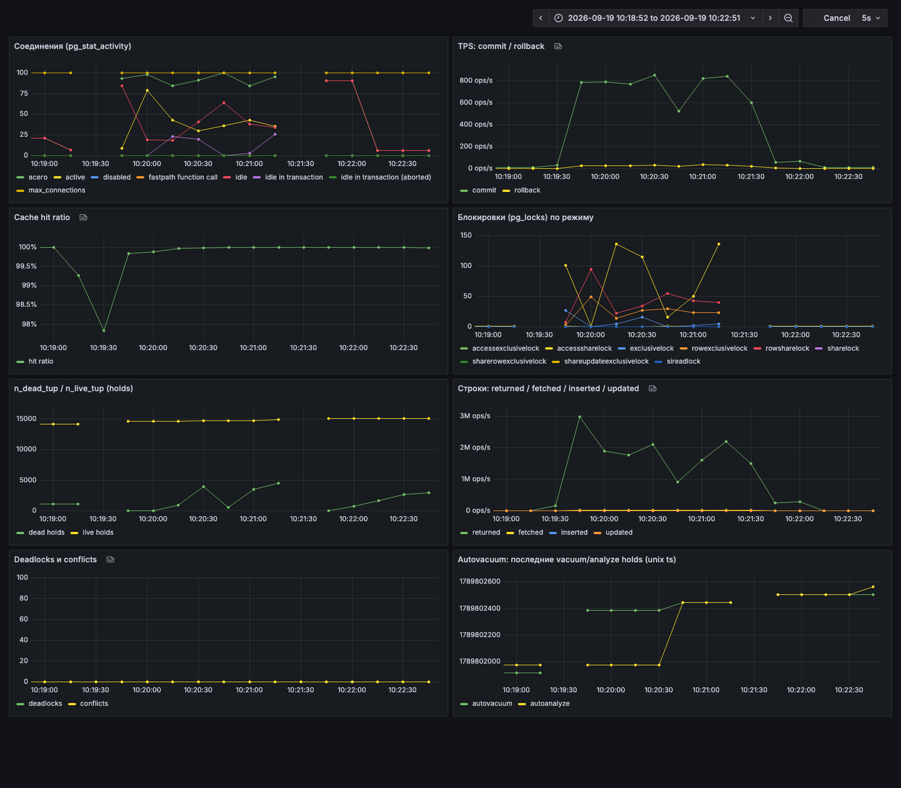

# Акт 1. Профиль под штормом: что показать студентам

Прогон 19.09.2026, 10:19:12 - 10:21:39. Ветка `demo/l2-baseline`, стенд после `make break-pool` (пул pgx 200, подключение напрямую к PostgreSQL, `max_connections=100`). Лимиты: postgres 1 CPU / 1 ГБ, soldout 2 CPU / 512 МБ. Нагрузка: `make storm`, 1 000 VU, 2 мин 20 с.

Сырые данные лежат рядом: `k6-summary.txt`, `pg-top.txt`, `pg-activity.txt`, `pg-activity-refused.txt`, `docker-stats.txt`, `explain.txt`, `pprof-top.txt`, `service-errors.txt`, `invariants.txt`. Скриншоты в `screens/`.

## Главный кадр акта

| Метрика | Значение |
|---|---|
| Запросов всего | 56 327 (400 RPS) |
| Ошибок 5xx | **63.45 %** (35 741) |
| Успешных hold | **1 006 из 19 421 (5 %)** |
| Успешных карт зала | **159 из 7 401 (2 %)** |
| Успешных входов в очередь | 19 421 из 29 505 (65 %) |
| p50 / p95 / p99 hold | 3.00 / 3.00 / 3.01 с |
| `make invariants` | все инварианты соблюдены |

Вывод: из тысячи покупателей билет смогли удержать пятеро из ста. При этом ни одного двойного бронирования, ни одного потерянного платежа. Система корректна и бесполезна одновременно. Корректность проверяется тестами, а вот это состояние видно только под нагрузкой.

Вторая фраза: посмотрите на p50, p95 и p99. Они одинаковые, 3.00 с. Это значение `HANDLER_TIMEOUT`. Мы измерили таймаут, латентность системы здесь вообще не видна. Отсюда правило занятия: сначала убираем ошибки, потом смотрим на хвосты.

## Кадр 1. k6: что видит пользователь



Куда показывать:

1. **"Ответы по статусу"** (внизу слева). Красная линия 503 держится около 200 в секунду и лежит выше зеленой линии 200. Желтая линия 201 (успешный hold) прижата к нулю.
2. **"Отправлено/получено байт/с"** (внизу справа). В первые секунды сервис отдает 8 МБ/с, это карты зала по 1.8 МБ. К 10:20 трафик падает до нуля и не возвращается: карта зала перестала отдаваться совсем. Вопрос залу: сервис стал быстрее или медленнее, если судить по трафику?
3. **"VU"**. Ровная полка в 1 000 пользователей, нагрузка постоянная. Деградация вызвана самой системой.

Дефект дашборда, из-за которого этот скриншот читается неправильно: панель "p95/p99 по name" подписывала ось в миллисекундах, фактические значения в секундах (3 ms на графике означает 3 с). Исправлено в `compose/grafana/provisioning/dashboards/k6.json`, на скриншотах актов 2 и 3 ось уже верная.

## Кадр 2. RED-дашборд: где сидит очередь



Куда показывать:

1. **"Пул pgx: занято / лимит"** (второй ряд справа). Желтая линия лимита на 200, зеленая линия занятых соединений упирается в 100 и выше не поднимается. Приложению разрешили 200, база дает 100. Разницу приложение получает в виде ошибок.
2. **"Ошибки 5xx/с по маршрутам"**. Два сорта ошибок: 500 (сюда попадает `too many clients`, пришедший из базы) и 503 (сработал таймаут хендлера). Оба растут вместе с нагрузкой.
3. **"p99 латентность по маршрутам"**. Все три маршрута лежат одной линией на 5 с, это верхний бакет гистограммы. Даже `queue/join`, который делает один INSERT, отвечает так же медленно, как карта на 40 000 мест. Общий ресурс (одно ядро базы) уравнял всех.
4. **"SQL p99 по запросу"**. Красная линия `catalog.seats_by_venue` на 2.5 с, остальные запросы под ней на 500 мс.
5. **"Go: горутины"**. 2 400 горутин: на каждого из 1 000 пользователей приходится больше двух ожидающих горутин. Приложение ничего не считает, оно стоит в очереди.
6. **"Кэш карты зала"** и **"Контенция hold"**: No data. Этих механизмов на baseline еще нет, панели оживут на шагах B и C.

## Кадр 3. docker stats: кто на самом деле занят

```
soldout-postgres-1   99.96%   240.6MiB / 1GiB
soldout-soldout-1    20.78%   217.5MiB / 512MiB
soldout-valkey-1      1.84%
```

Вывод: у приложения 2 ядра, занято 20 %. У базы 1 ядро, занято 100 %. Первое желание при 63 % ошибок: добавить подов приложения. Посмотрите на цифры и скажите, что произойдет, если поставить 5 подов вместо одного. Ответ: каждый принесет свой пул на 200 соединений к той же базе на 100.

## Кадр 4. pg_stat_activity: база отказала даже нам

Первая попытка `make pg-activity` во время шторма:

```
psql: error: FATAL:  sorry, too many clients already
```

Это лучший кадр акта, его стоит показать живьем. Инструмент диагностики не смог подключиться к базе, потому что приложение заняло все слоты (93 из 100, остальные зарезервированы). То же видно на дашборде PostgreSQL: линии обрываются, потому что `postgres_exporter` тоже получал отказ. Мониторинг слепнет ровно тогда, когда он нужен.

За 2 минуты: 5 273 ошибки `too many clients already (SQLSTATE 53300)` в логах сервиса, 7 229 отказов в логе PostgreSQL.

Вторая попытка прошла:

```
        state        | wait_event_type | wait_event  | count
---------------------+-----------------+-------------+-------
 idle                | Client          | ClientRead  |    26
 idle in transaction | Client          | ClientRead  |    25
 active              | Client          | ClientWrite |    12
 active              |                 |             |     8
 active              | LWLock          | ProcArray   |     4
 active              | LWLock          | WALWrite    |     2
 active              | IO              | WalSync     |     1
```

Как читать:

- **8 active без ожидания**: реально работают на CPU. Ядро одно, значит 7 из них ждут планировщик ОС.
- **25 idle in transaction**: транзакция открыта, база ждет следующую команду от приложения. Приложение в этот момент само стоит в очереди за CPU или за другим соединением. Слот занят, работа не идет.
- **12 active / ClientWrite**: база пытается отдать клиенту 40 000 строк карты зала, клиент не успевает читать.
- **26 idle**: соединения открыты и простаивают. Слот в `max_connections` они все равно занимают.

Итог: из 93 соединений полезную работу в каждый момент делает одно.

## Кадр 5. pg_stat_statements: куда ушло время базы

```
 calls | total_ms | mean_ms |   rows   | query
-------+----------+---------+----------+---------------------------------
   495 | 351796.3 |  710.70 | 19800000 | catalog.seats_by_venue
 19909 | 118587.4 |    5.96 |    19909 | queue.insert_admission
  1718 |  56830.5 |   33.08 |     1718 | booking.count_user_holds
 20893 |  55678.8 |    2.66 |    20893 | FOR KEY SHARE (проверка FK events)
 47027 |  53548.2 |    1.14 |    47027 | catalog.get_event
  1350 |  13685.1 |   10.14 |     1350 | booking.seat_sold
   984 |   5668.6 |    5.76 |      984 | booking.insert_hold
```

Перед показом спросить зал: какой запрос первый? Обычно называют hold. Hold на последнем месте, 5.7 с из 680.

Что проговорить:

1. **Сортируем по `total_ms`.** Карта зала вызвана 495 раз, в 40 раз реже остальных, и съела половину времени базы: 352 с.
2. **Арифметика.** Сумма по таблице около 680 с работы за 140 с шторма. База получила заказ на 4.9 ядра, а у нее одно. Остальное стало очередью.
3. **Один и тот же запрос, разная цена.** В прогоне с пулом 40 `seats_by_venue` занимал 98 мс на вызов. Здесь 711 мс, в 7 раз дольше. SQL не менялся, план не менялся. Поменялось число конкурентов за одно ядро: 100 вместо 20. Это закон Литтла в живом виде: больше соединений дают меньше пропускной способности.
4. **Страдают невиновные.** `get_event` читает одну строку по первичному ключу, его нормальная цена 0.01 мс. Здесь 1.14 мс, в 100 раз дороже. `insert_admission` вырос с 0.13 до 6 мс. Один тяжелый запрос портит латентность всем.
5. **`hit_pct` = 100 %.** Все данные в памяти, диск не участвует. Увеличение `shared_buffers` или быстрый диск ничего не дадут.

## Кадр 6. EXPLAIN: почему лимит 4 стоит 33 мс

```
Seq Scan on holds  (actual time=0.008..1.228 rows=898 loops=1)
  Filter: status = ANY ('{active,confirmed}') AND event_id = ...
  Rows Removed by Filter: 14157
Execution Time: 1.268 ms
```

Запрос читает все 15 055 строк таблицы `holds`, чтобы вернуть 898. В тишине это 1.3 мс, и на ревью такой запрос выглядит безобидно. Под штормом тот же скан в `count_user_holds` стоит 33 мс, потому что выполняется на каждый hold и делит ядро с сотней соседей. Таблица растет с каждой секундой продажи, скан дорожает вместе с ней.

## Кадр 7. Профиль приложения: на что Go тратит CPU



Скриншот Pyroscope покрывает последний час, то есть оба сегодняшних прогона (два пика на графике CPU). `SeatsByVenue` с потомками занимает 1.14 мин из 2.15 мин CPU: больше половины процессорного времени приложения уходит на разбор 40 000 строк карты зала (`pgx.Scan`, `uuid.Parse`, `hex.Encode`, аллокации).

Профиль строго за окно этого шторма (`pprof-top.txt`) выглядит иначе, и это отдельный сюжет:

| Функция | Доля CPU |
|---|---|
| `Syscall6` (сеть) | 25.5 % |
| `SeatsByVenue` с потомками | 18.0 % |
| `pbkdf2.Key` с потомками | **12.7 %** |

`pbkdf2` и `sha256` здесь от SCRAM-аутентификации PostgreSQL. Приложение непрерывно пытается открыть новые соединения, получает отказ, пробует снова, и каждая попытка стоит вычисления ключа. Восьмая часть CPU приложения уходит на попытки достучаться до базы, которая все равно откажет. Неограниченный пул вредит с обеих сторон: базе и самому приложению.

Панель flame graph в headless-скриншоте не отрисовалась, видна только таблица. На занятии открывать живьем: Grafana -> Explore -> Pyroscope -> `process_cpu`, сервис `soldout`.

## Кадр 8. Дашборд PostgreSQL



Куда показывать:

1. **"Соединения"**. Зеленая линия всех соединений лежит на желтой `max_connections` = 100. Разрывы в линиях: экспортер метрик сам получал `too many clients`.
2. **"TPS"**. Потолок 800 транзакций в секунду. Запомнить цифру, на шаге B она вырастет на порядок.
3. **"Строки: returned"**. До 3 млн строк в секунду. База честно читает и отдает по 40 000 строк на каждый запрос карты.
4. **"Cache hit ratio"** около 100 %, **"Deadlocks"** ноль. Память и взаимные блокировки ни при чем.

## Вывод акта: три гипотезы с доказательствами

| № | Гипотеза | Доказательство | Чиним на шаге |
|---|---|---|---|
| 1 | Пул 200 больше `max_connections` 100 | `too many clients` в логах и в psql, панель пула, 93 соединения при одном работающем, 12.7 % CPU на SCRAM | A |
| 2 | Нет индексов под лимит 4 и `SeatSold` | `Seq Scan on holds`, `count_user_holds` 33 мс | A |
| 3 | Карта зала отдается целиком на каждый запрос | 352 с из 680 с времени базы, 53 % CPU приложения, трафик 8 МБ/с | B |

Порядок исправлений задает цена: пул и индексы стоят одного коммита и не меняют архитектуру, поэтому идут первыми. Карта зала требует проекции и кэша, это шаг B.

Вопрос залу перед переходом к шагу A: какая из трех причин дает 63 % ошибок? Ответ проверим следующим прогоном.

## Расхождение с results.md

В `results.md` baseline записан как 22.9 % ошибок. Сегодняшний честный baseline дал 63.45 %, что совпадает с ожиданием спеки (55 %). Причина расхождения: до сегодняшнего исправления `make storm` пересоздавал сервис с дефолтным окружением (пул 40 через PgBouncer) и молча отменял `make break-pool`. Прежняя цифра, вероятно, снята на наполовину починенной конфигурации. Строка baseline в `results.md` обновлена, туда же добавлен раздел "Перепроверка 19.09.2026" с тремя прогонами. Продолжение: `../act2/README.md` (шаг A) и `../act3/README.md` (шаг B).
