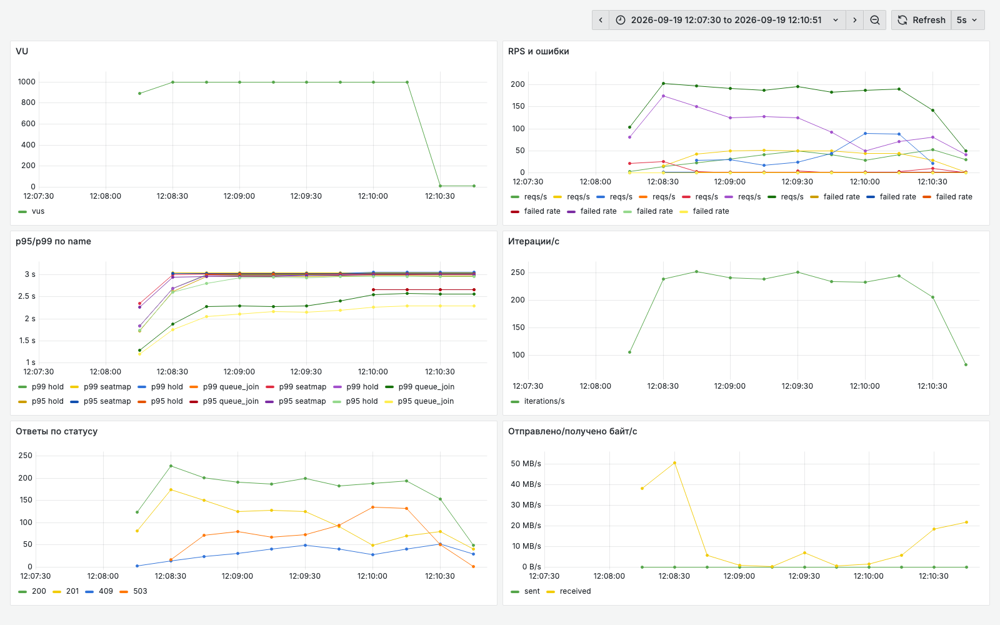
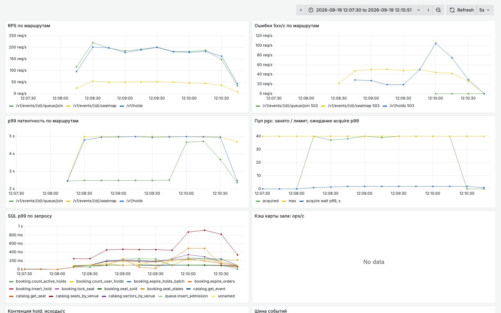

# Акт 2. Шаг A: пул и индексы. Что дал каждый из них

Прогон 19.09.2026, 09:08:00 - 09:10:21 UTC. Ветка `demo/l2-stepA`, стенд после `make switch BRANCH=demo/l2-stepA`. Лимиты те же, что в акте 1: postgres 1 CPU / 1 ГБ, soldout 2 CPU / 512 МБ. Нагрузка та же: `make storm`, 1 000 VU, 2 мин 20 с, 80 % hold и 20 % карта зала.

Что изменилось относительно акта 1 (гипотезы 1 и 2 из `../act1/README.md`):

- пул приложения 200 напрямую в PostgreSQL заменен на 40 через PgBouncer (`default_pool_size` 20, transaction pooling), ожидание соединения ограничено 2 с и дает 503 `db_busy`;
- миграции 0006-0010: `holds_user_active_idx` под лимит 4, `holds_expires_active_idx` для expirer, `tickets_event_seat_uidx` под I2 и `SeatSold`, `holds_taken_uidx` под проверку занятости места.

Гипотеза 3 (карта зала целиком на каждый запрос) на этом шаге не тронута.

Состояние БД перед прогоном: 2 419 строк в `holds`, из них 0 активных, 0 билетов. То же состояние было перед прогоном акта 1, прогоны сравнимы.

Сырые данные рядом: `k6-summary.txt`, `pg-top.txt`, `pg-activity.txt`, `pgbouncer-pools.txt`, `docker-stats.txt`, `explain.txt`, `explain-after-storm.txt`, `pprof-top.txt`, `service-errors.txt`, `invariants.txt`, `db-before.txt`, `db-after.txt`.

## Главный кадр акта

| Метрика | Акт 1, baseline | Акт 2, шаг A |
|---|---|---|
| Запросов всего | 56 327 (400 RPS) | 62 087 (443 RPS) |
| Ошибок 5xx | **63.45 %** | **17.92 %** |
| Успешных hold | 1 006 из 19 421 (5 %) | **22 190 из 27 479 (80 %)** |
| Успешных карт зала | 159 из 7 401 (2 %) | 1 292 из 7 043 (18 %) |
| Успешных входов в очередь | 19 421 из 29 505 (65 %) | 27 479 из 27 565 (99 %) |
| p50 / p95 / p99 hold | 3.00 / 3.00 / 3.01 с | 2.59 / 3.00 / 3.01 с |
| p99 карты зала | 3.01 с | 3.04 с |
| Отдано данных | 311 МБ (2.2 МБ/с) | 2.4 ГБ (17 МБ/с) |
| Соединений к PostgreSQL | 93 из 100 | 22 из 100 |
| `too many clients` за прогон | 5 273 в сервисе, 7 229 в логе БД | 0 и 0 |
| `make invariants` | OK | OK |

Вывод: билет получили 22 190 покупателей вместо 1 006. Ошибки при этом не исчезли, их 18 %, и теперь они собраны в одном месте. Гипотеза 1 стоила одной строки конфигурации и дала 45 процентных пунктов из 63.

Вторая фраза: p99 hold как был 3.01 с, так и остался. Это по-прежнему `HANDLER_TIMEOUT`, а совпадение p95 и p99 говорит, что часть запросов все еще упирается в таймаут. Латентность системы не видна, пока живы ошибки.

## Кадр 0. Дашборды: что видно сразу



Панель "Ответы по статусу" против акта 1: зеленая линия 200 держится около 190 в секунду, желтая 201 (успешный hold) поднялась с нуля до 70-175, красной полки 503 на 200 в секунду больше нет. Ось на панели p95/p99 теперь подписана в секундах, дефект дашборда из акта 1 исправлен (`compose/grafana/provisioning/dashboards/k6.json`).

Панель "Отправлено/получено байт/с" показывает 50 МБ/с в первые секунды и провал к середине шторма: карта зала конкурирует сама с собой.



1. **"Пул pgx: занято / лимит"**. Зеленая линия занятых лежит на желтой линии лимита 40. В акте 1 приложению разрешали 200, а база давала 100, и разница превращалась в ошибки. Теперь лимит приложения ниже возможностей базы, и очередь стоит перед пулом: `acquire wait p99` около 1.5 с при таймауте 2 с.
2. **"Ошибки 5xx/с по маршрутам"**. Ошибки 500 исчезли: `too many clients` больше не доходит до хендлера. Осталась желтая линия 503 у карты зала (45 в секунду) и синий всплеск 503 у `/v1/holds` в конце прогона, когда зал заполнился и очередь за соединением выросла.
3. **"SQL p99 по запросу"**. `catalog.seats_by_venue` (красная) поднимается до 900 мс, остальные запросы лежат под 250 мс.

## Кадр 1. База перестала отказывать

```
connections=22 max_connections=100
too_many_clients=0
pg_log_too_many_clients=0
```

В акте 1 приложение держало 93 соединения из 100 и получило 5 273 отказа `too many clients`. Теперь занято 22 слота, отказов ноль, `make pg-activity` и экспортер метрик подключаются в любой момент шторма. Мониторинг перестал слепнуть под нагрузкой.

`pg_stat_activity` в середине шторма:

```
        state        | wait_event_type | wait_event | count
---------------------+-----------------+------------+-------
 idle in transaction | Client          | ClientRead |     6
 idle                | Client          | ClientRead |     4
 active              | LWLock          | WALWrite   |     3
 active              |                 |            |     3
 idle                |                 |            |     2
 active              | Timeout         | SpinDelay  |     1
 active              | IO              | WalSync    |     1
```

Против 93 сессий акта 1 здесь 20 рабочих соединений от PgBouncer. Доля реально работающих на CPU выросла: 3 active без ожидания на 20 сессий против 8 на 93.

## Кадр 2. Очередь никуда не делась, она переехала

`SHOW POOLS` в середине шторма:

```
 database | cl_active | cl_waiting | sv_active | sv_idle | maxwait_us | pool_mode
----------+-----------+------------+-----------+---------+------------+-------------
 soldout  |        20 |         20 |        20 |       0 |      63993 | transaction
```

Двадцать клиентских соединений работают, двадцать ждут, максимальное ожидание 64 мс. Ровно это имеется в виду под оговоркой 1: пул ничего не ускоряет, он переносит очередь из базы в приложение и в пулер. Разница с актом 1 в том, что ожидание стало ограниченным и измеримым, а вместо `FATAL: too many clients` система отвечает 503 за 2 с.

За прогон PgBouncer обслужил 66 368 транзакций и 117 651 запрос на 20 серверных соединениях, суммарное время ожидания 760 с против 1 592 с времени транзакций.

## Кадр 3. Индексы: цена запроса упала на два порядка

`EXPLAIN` того же запроса, что в акте 1, на пустом зале:

```
Bitmap Heap Scan on holds (actual time=0.007..0.007 rows=0 loops=1)
  -> Bitmap Index Scan on holds_taken_uidx (actual time=0.003..0.003 rows=0)
Execution Time: 0.022 ms
```

Было `Seq Scan` с чтением 15 055 строк и 1.268 мс, стало 0.022 мс.

Средняя цена запросов в базе, акт 1 против акта 2:

| Запрос | Baseline, мс | Шаг A, мс |
|---|---|---|
| `booking.count_user_holds` | 33.08 | **0.05** |
| `booking.seat_sold` | 10.14 | **0.03** |
| `queue.insert_admission` | 5.96 | 0.20 |
| `booking.insert_hold` | 5.76 | 0.43 |
| `catalog.get_event` | 1.14 | 0.03 |
| `catalog.seats_by_venue` | 710.70 | 86.34 |

Здесь смешаны два эффекта, и их стоит развести вслух. `count_user_holds` и `seat_sold` подешевели потому, что у них появился индекс. Остальные подешевели потому, что перестали ждать в очереди за ядро: SQL и планы у них не менялись.

Отдельный кадр для сильных студентов: тот же `EXPLAIN` после шторма, когда в зале 17 128 активных hold из 19 547 строк таблицы, снова показывает `Seq Scan` и 2.391 мс. Планировщик прав: индекс выгоден, пока выборка селективна, а когда под условие подходит 87 % таблицы, дешевле прочитать ее целиком.

## Кадр 4. pg_stat_statements: осталась одна проблема

```
 calls | total_ms | mean_ms |   rows    | query
-------+----------+---------+-----------+--------------------------------
  5746 | 496086.1 |   86.34 | 229840000 | catalog.seats_by_venue
 17217 |   7394.2 |    0.43 |     17217 | booking.insert_hold
 27479 |   5545.2 |    0.20 |     27479 | queue.insert_admission
  1333 |   5137.5 |    3.85 |   8147490 | booking.seat_states
 44696 |   3185.3 |    0.07 |     44696 | FOR KEY SHARE (проверка FK events)
 27416 |   2642.1 |    0.10 |     27416 | catalog.get_seat
 62049 |   1567.4 |    0.03 |     62049 | catalog.get_event
 22651 |   1242.9 |    0.05 |     22651 | count_user_holds
```

Суммарное время базы 524 с против 680 с в акте 1. Доля карты зала выросла с 52 % до 95 %: все прочее стало бесплатным на ее фоне.

Внутри карты зала два встречных движения. Вызовов стало 5 746 вместо 495, в 11.6 раза больше: раньше запросы не доходили до базы, приложение не могло получить соединение. Цена одного вызова упала с 711 мс до 86 мс, в 8.2 раза: конкурентов за одно ядро стало 20 вместо 100. Это закон Литтла с другой стороны: меньше параллелизма при той же мощности дает больше пропускной способности.

Арифметика по ядрам. В акте 1 база получала заказ на 4.9 ядра при одном имеющемся, теперь на 3.7. Из них 3.5 ядра приходится на карту зала: 496 с работы за 140 с шторма. Пока этот запрос жив, любое дальнейшее исправление упрется в него.

Трафик вырос с 311 МБ до 2.4 ГБ за прогон. Карты зала действительно начали отдаваться, и каждая весит 1.8 МБ.

## Кадр 5. Профиль приложения: SCRAM исчез, карта осталась

| Функция | Baseline | Шаг A |
|---|---|---|
| `Syscall6` (сеть) | 25.5 % | 10.1 % |
| `SeatsByVenue` с потомками | 18.0 % | **64.4 %** |
| `pbkdf2.Key` с потомками | 12.7 % | **отсутствует** |
| `encoding/json` сериализация | в акте 1 не выделялась | 15.5 % |

Восьмая часть CPU, которая в акте 1 уходила на SCRAM при бесконечных попытках открыть соединение, освободилась целиком: пул 40 открывает соединения один раз и держит их. Это чистый выигрыш от гипотезы 1, и его не видно ни в одной метрике латентности.

Освободившееся время ушло туда же, куда и все остальное: `pgx.Scan` 44 %, `uuid.Parse` 6 %, `hex.Encode` 4.7 %, сериализация JSON 15.5 %. Приложение разбирает и кодирует 40 000 мест на каждый запрос карты.

## Кадр 6. docker stats: теперь заняты оба

```
soldout-postgres-1    99.34%   126.2MiB / 1GiB
soldout-soldout-1     99.61%   243.5MiB / 512MiB
soldout-pgbouncer-1   25.93%     3.1MiB
```

В акте 1 приложение было занято на 20 % при упертой в потолок базе. Теперь оба узла работают: postgres на своем единственном ядре, soldout на половине своих двух. Гипотеза 3 бьет по обоим сразу, база читает 40 000 строк, приложение их разбирает и сериализует.

Это ответ на вопрос акта 1 про пять подов приложения. Добавление подов сейчас не поможет тем более: узкое место общее для всех.

## Вывод акта

| Гипотеза | Состояние | Чем доказано |
|---|---|---|
| 1. Пул 200 больше `max_connections` 100 | закрыта | 0 отказов `too many clients`, 22 соединения, SCRAM ушел из профиля, ошибки 63 % -> 18 % |
| 2. Нет индексов под лимит 4 и `SeatSold` | закрыта | `count_user_holds` 33 -> 0.05 мс, `seat_sold` 10 -> 0.03 мс, `Index Scan` вместо `Seq Scan` |
| 3. Карта зала отдается целиком | открыта | 95 % времени базы, 64 % CPU приложения, 2.4 ГБ трафика, p99 карты 3.04 с |

Ответ на вопрос, заданный в конце акта 1: 45 процентных пунктов из 63 дал пул, оставшиеся 18 дает карта зала. Порядок исправлений был выбран по цене, и дешевое исправление закрыло большую часть проблемы.

Что не изменилось: p99 hold 3.01 с, то есть таймаут хендлера. Пока каждый пятый запрос отваливается по таймауту, хвосты измерять рано. Переходим к шагу B, где карта зала перестает быть запросом к базе.
