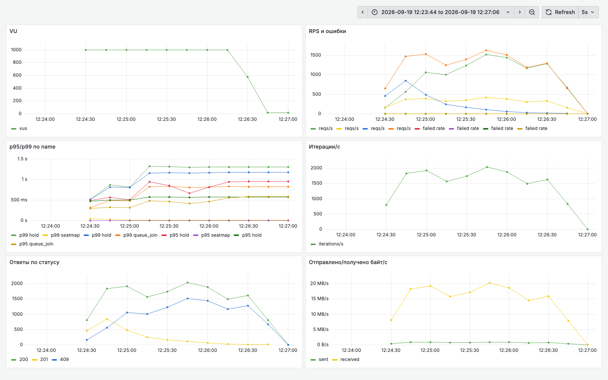
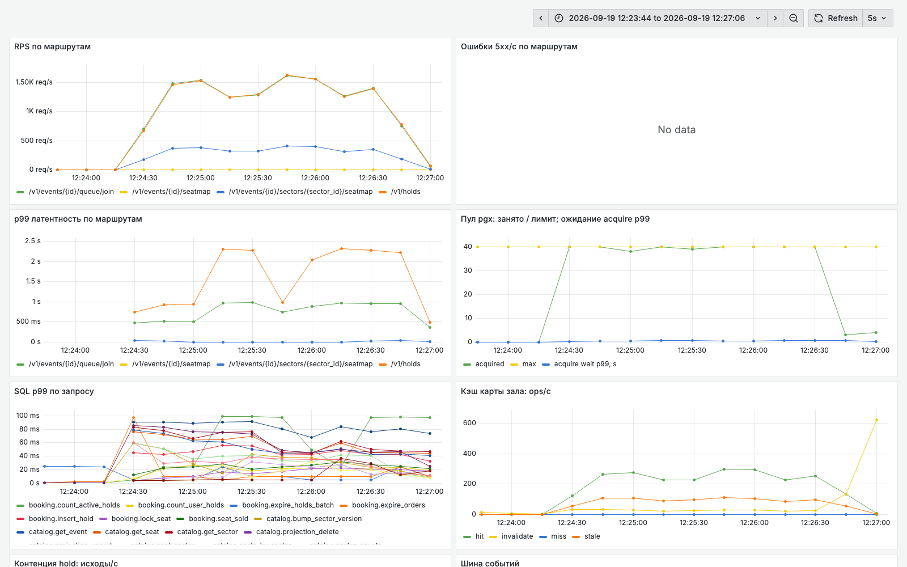

# Акт 3. Шаг B: карта зала уходит из базы

Прогон 19.09.2026, 09:24:14 - 09:26:36 UTC. Ветка `demo/l2-stepB`, стенд после `make switch BRANCH=demo/l2-stepB`. Лимиты и нагрузка те же: postgres 1 CPU / 1 ГБ, soldout 2 CPU / 512 МБ, `make storm`, 1 000 VU, 2 мин 20 с.

Что изменилось относительно шага A (гипотеза 3 из `../act1/README.md`):

- проекция `catalog_seat_state` в модуле catalog, обновляется событиями через `platform/eventbus` после commit;
- `GET /v1/events/{id}/seatmap` отдает сводку по секторам (5.8 КБ) вместо полной карты (1.8 МБ);
- `GET /v1/events/{id}/sectors/{sector_id}/seatmap` отдает карту одного сектора (44 КБ) из Valkey с версией из БД, stale-while-revalidate и ETag.

Сценарий k6 на этом шаге запрашивает карту сектора вместо карты всего зала. Это часть исправления: контракт API изменился, сравниваются разные ручки.

Состояние БД перед прогоном: 42 188 строк в `holds`, из них 0 активных. Зал перед стартом пуст, как в актах 1 и 2.

Сырые данные рядом. В `run-loaded/` лежит первый прогон шага B, сделанный на зале, заполненном на 43 %; он разобран в конце.

## Главный кадр: три прогона подряд

| Метрика | Акт 1, baseline | Акт 2, шаг A | Акт 3, шаг B |
|---|---|---|---|
| Запросов всего | 56 327 (400 RPS) | 62 087 (443 RPS) | **433 053 (3 093 RPS)** |
| Ошибок 5xx | 63.45 % | 17.92 % | **0.00 %** |
| Создано hold (201) | 984 | 17 217 | **39 675** |
| Ответов 409 (место занято) | 22 | 4 973 | 152 538 |
| Запросов карты | 7 401, успешно 159 | 7 043, успешно 1 292 | 48 627, успешно 48 627 |
| p50 / p95 / p99 hold | 3.00 / 3.00 / 3.01 с | 2.59 / 3.00 / 3.01 с | **0.38 / 0.90 / 1.29 с** |
| p99 карты | 3.01 с (зал, 1.8 МБ) | 3.04 с (зал, 1.8 МБ) | **11.5 мс (сектор, 44 КБ)** |
| Время работы БД за прогон | 680 с | 524 с | **38 с** |
| Соединений к PostgreSQL | 93 из 100 | 22 из 100 | 22 из 100 |
| CPU postgres / soldout | 100 % / 21 % | 99 % / 100 % | 104 % / 74 % |
| `make invariants` | OK | OK | OK (I6 через 30 с после шторма) |

Вывод: запросов в 7.7 раза больше, ошибок ноль, база работает 38 с вместо 680 с за те же 140 с шторма. Два предыдущих шага стоили одной строки конфигурации и пяти миграций и дали рост в 1.1 раза. Этот шаг потребовал проекции, шины событий и кэша и дал рост в 7 раз.

## Кадр 1. k6: экран пользователя



1. **"Ответы по статусу"**. Линии 503 нет совсем. Зеленая линия 200 держится около 1 800 в секунду, желтая 201 падает от 850 к нулю за первую минуту, синяя 409 растет до 1 500. Это сюжет сам по себе: при 3 000 RPS зал на 40 000 мест разбирают за 40 с, дальше система честно отвечает "место занято".
2. **"p95/p99 по name"**. Карта сектора лежит на нуле (фиолетовая и желтая линии), hold на 1.2-1.4 с. Впервые за три прогона на этой панели видна латентность системы, а не `HANDLER_TIMEOUT`.
3. **"Отправлено/получено байт/с"**. 17 МБ/с против 50 МБ/с в первые секунды шага A, при этом запросов в 7 раз больше. Карта сектора весит 44 КБ, и три четверти запросов к ней обслуживает кэш.

## Кадр 2. RED-дашборд: панели, которые молчали на baseline



1. **"Ошибки 5xx/с по маршрутам"**: No data. В акте 1 тут было две линии по 200 в секунду.
2. **"Кэш карты зала"** ожил: hit около 250-300 в секунду, stale около 100, miss ноль. Stale отдается сразу и пересобирается в фоне, поэтому провалов латентности на карте нет.
3. **"Пул pgx: занято / лимит"**. Занято 40 из 40, `acquire wait p99` около нуля против 1.5 с на шаге A. Пул занят полностью, но соединение освобождается за миллисекунды.
4. **"SQL p99 по запросу"**. Все запросы уложились под 100 мс, `catalog.seats_by_venue` исчез с панели.

## Кадр 3. pg_stat_statements: карта зала пропала из топа

```
 calls  | total_ms | mean_ms |  rows  | query
--------+----------+---------+--------+--------------------------------
 192213 |   9599.0 |    0.05 | 192213 | queue.insert_admission
 192213 |   7227.5 |    0.04 | 192213 | catalog.get_seat
  39675 |   4784.8 |    0.12 |  39675 | booking.insert_hold
 231888 |   4282.0 |    0.02 | 231888 | FOR KEY SHARE (проверка FK events)
 192213 |   4149.0 |    0.02 | 192213 | booking.count_user_holds
 192213 |   3681.8 |    0.02 | 192213 | booking.seat_sold
 387549 |   2581.4 |    0.01 | 387549 | catalog.get_event
  39675 |    826.9 |    0.02 |  39675 | FOR KEY SHARE (проверка FK seats)
 192213 |    651.9 |    0.00 | 192213 | booking.lock_seat
```

Первый запрос по времени теперь стоит 0.05 мс и вызван 192 213 раз. Сумма по таблице 38 с против 680 с в акте 1 при семикратной нагрузке. Запроса `catalog.seats_by_venue`, который съедал половину, а затем 95 % времени базы, в списке нет вообще: карта сектора собирается из проекции (2 946 вызовов `catalog.sector_states` на 48 627 запросов) и дальше отдается из Valkey.

Проверка карты сектора против базы больше не читает `holds`. Чтение чужой таблицы из catalog исчезло вместе с запросом, и это архитектурный итог шага, а не только выигрыш по времени.

## Кадр 4. Куда переехало узкое место

```
        state        | wait_event_type | wait_event | count
---------------------+-----------------+------------+-------
 active              | LWLock          | WALWrite   |    14
 idle in transaction | Client          | ClientRead |     4
 active              | IO              | WalSync    |     1
```

Четырнадцать сессий из двадцати ждут `LWLock WALWrite`. При 38 с работы запросов postgres по-прежнему занимает 104 % своего ядра: время ушло из выполнения запросов в журнал и фиксацию транзакций. При 1 500 hold в секунду каждая транзакция требует записи в WAL, и ядро упирается в это.

Профиль приложения подтверждает то же с другой стороны: `Syscall6` 40 %, дальше только `runtime` (futex, nanotime, selectgo). Приложение ничего не считает, оно ждет сеть и базу. `SeatsByVenue`, который занимал 64 % CPU на шаге A, исчез.

Отсюда следующая гипотеза для шага C: 192 213 вызовов `pg_advisory_xact_lock` на каждую попытку hold плюс индекс, который и так гарантирует уникальность. Два механизма на одну гарантию.

## Кадр 5. Инварианты и честная цена кэша

Сразу после шторма:

```
I6  проекция карты совпадает с истиной (holds)   32 727   НАРУШЕН
```

Через 30 с:

```
I6  проекция карты совпадает с истиной (holds)        0   OK
```

Шина событий догоняет 40 000 изменений примерно за полминуты после пика. Это цена проекции, и ее стоит показать живьем: карта отстает от истины, а истина в транзакции остается целой. I1-I4 зеленые в обоих замерах, двойных бронирований нет.

## Что не достигнуто

Порог занятия (`http_req_failed < 1 %` и p99 hold < 500 мс) выполнен наполовину: ошибок ноль, p99 hold 1.29 с. Три причины, все проверяемые:

1. Зал разбирают за 40 с, дальше 152 538 из 192 213 попыток hold упираются в занятое место и проходят полный путь проверок ради ответа 409.
2. В `holds` 81 863 строки и 426 238 строк в `admissions`, накопленных предыдущими прогонами. На чистой БД (`make down && make up`) шаг B давал p99 hold 397 мс (`results.md`).
3. Advisory lock на каждое место остается в транзакции hold, его снимает шаг C.

## Первый прогон шага B: зал, заполненный на 43 %

Первый прогон (`run-loaded/`) стартовал сразу после шага A, когда в зале висело 17 128 активных hold. Цифры: 418 623 запроса, 2 990 RPS, 0 % ошибок, hold p99 1.03 с, карта сектора p99 6.58 мс.

Сравнивать его с актами 1 и 2 нельзя: в зале с самого начала занято 43 % мест, доля быстрых 409 выше, и часть работы система просто не делает. Прогон оставлен как отдельный материал: он показывает, что даже на заполненном зале шаг B держит ноль ошибок. Для строгого сравнения зал был очищен истечением TTL (10 минут, expirer по 500 строк каждые 5 с, 39 769 hold вычищены за 6 минут), и шторм повторен с нуля активных hold.

Отдельная находка того же прогона: `EXPLAIN` перед строгим прогоном выбрал `Seq Scan` по 42 188 строкам `holds` (7 мс) при нулевом результате, потому что после массового истечения hold статистика таблицы устарела и планировщик ждал 1 087 подходящих строк. Индекс на месте, план выбран по устаревшим оценкам. Материал для разговора про autovacuum и `ANALYZE` после массовых обновлений.

## Итог трех прогонов

| Гипотеза из акта 1 | Шаг | Что дала |
|---|---|---|
| 1. Пул 200 больше `max_connections` 100 | A | ошибки 63.45 % -> 17.92 %, отказы `too many clients` в ноль, 12.7 % CPU приложения освободились от SCRAM |
| 2. Нет индексов под лимит 4 и `SeatSold` | A | `count_user_holds` 33 -> 0.05 мс, `seat_sold` 10 -> 0.03 мс |
| 3. Карта зала отдается целиком | B | ошибки 17.92 % -> 0 %, RPS 443 -> 3 093, время работы БД 524 -> 38 с |

Порядок был выбран по цене исправления, и он же оказался порядком по эффекту наоборот: дешевые исправления сняли большую часть ошибок, архитектурное изменение дало рост пропускной способности. Ни один шаг не тронул инварианты: I1-I4 зеленые во всех трех прогонах.
