# Архитектура soldout: верхний уровень и ключевые сценарии

Документ описывает код ветки `demo/l2-baseline` (это `lesson-1` на стенде занятия 2). Диаграммы пересказывают код: при расхождении верен код. Источники истины рядом: `spec/soldout.md` (требования и расчет нагрузки), `api/openapi.yaml` (контракт HTTP), `.go-arch-lint.yml` (правило зависимостей), `migrations/` (схема данных), `docs/constitution.md` (инварианты).

Задача системы: продать 40 000 мест на один концерт, старт продаж в 12:00, интерес порядка 2 000 000 человек. Ни одно место не должно быть продано дважды, ни один оплаченный заказ не должен потеряться.

## 1. Контекст

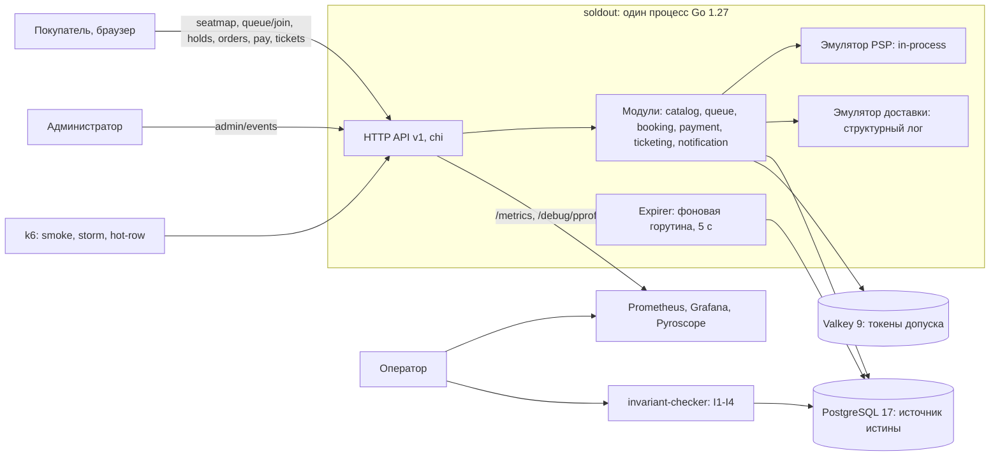

Платежный провайдер и канал доставки уведомлений живут внутри процесса как эмуляторы с управляемыми отказами (`PSP_FAIL_RATE`, `PSP_DELAY_MS`). Внешних интеграций у системы нет: все, что выглядит как внешний мир, подменено адаптером.

## 2. Стенд

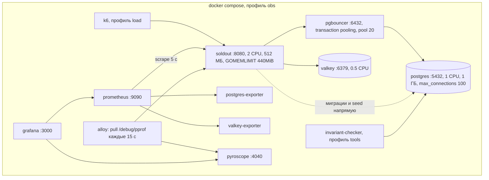

Лимиты CPU и памяти заданы в `compose/lesson-02.yml`. Без них 12 ядер ноутбука прячут узкие места: стенд перестает воспроизводить прод в масштабе 1:100.

На baseline пул приложения ходит в PostgreSQL напрямую (`DB_MAX_CONNS=200` против `max_connections=100`), PgBouncer поднят и не используется: `/readyz` отдает `"pgbouncer":"direct"`. С шага A приложение подключается через пулер.

Миграции и seed всегда идут в PostgreSQL напрямую по `DATABASE_URL_DIRECT`: `golang-migrate` держит сессионный advisory-lock, несовместимый с transaction pooling, а `statement_timeout=0` нужен для `CREATE INDEX CONCURRENTLY`.

## 3. Модули и правило зависимостей

Модуль импортирует другой модуль только через его пакет `api` (DTO, ошибки, интерфейсы). Правило машиночитаемо и проверяется в CI: `make lint-arch`.

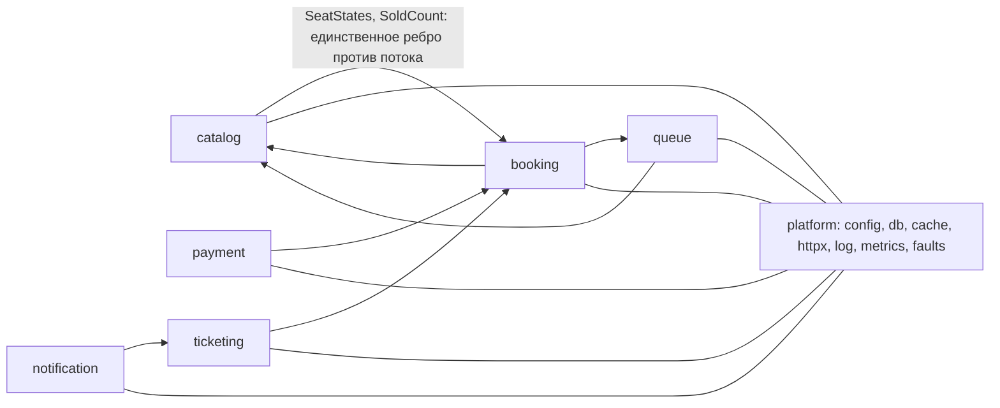

| Модуль | Ответственность | Владеет данными | HTTP |
|---|---|---|---|
| `catalog` | мероприятия, площадки, секторы, места, карта зала | `venues`, `sectors`, `seats`, `events` | `GET /v1/events`, `GET /v1/events/{id}`, `GET /v1/events/{id}/seatmap`, `POST /v1/admin/events`, `POST /v1/admin/events/{id}/open` |
| `queue` | допуск в waiting room, проверка токена | `admissions`, ключи Valkey `admission:{token}` | `POST /v1/events/{id}/queue/join` |
| `booking` | hold, release, заказ, оплата как сценарий, лимит 4, истечение | `holds`, `orders`, `order_items` | `POST /v1/holds`, `GET /v1/holds/{id}`, `DELETE /v1/holds/{id}`, `POST /v1/orders`, `GET /v1/orders/{id}`, `POST /v1/orders/{id}/pay` |
| `payment` | идемпотентное списание через эмулятор PSP | `payments` | нет, вызывается через порт |
| `ticketing` | выпуск билета с кодом, чтение билетов | `tickets` | `GET /v1/users/{id}/tickets` |
| `notification` | запись и доставка уведомлений | `notifications` | нет, вызывается через порт |
| `platform` | конфигурация, пул pgx, кэш, HTTP-обвязка, логи, метрики, fault-flags | `outbox` появится на занятии 3 | `/healthz`, `/readyz`, `/metrics`, `/debug/pprof` |

Сборка зависимостей целиком лежит в `cmd/soldout/main.go`: там `booking` получает `payment` и `ticketing` как реализации портов `PaymentGateway` и `TicketIssuer`, объявленных в `booking/api`. Направление импортов при этом остается прежним: `payment` знает про `booking.api`, обратного импорта нет.

## 4. Устройство одного модуля

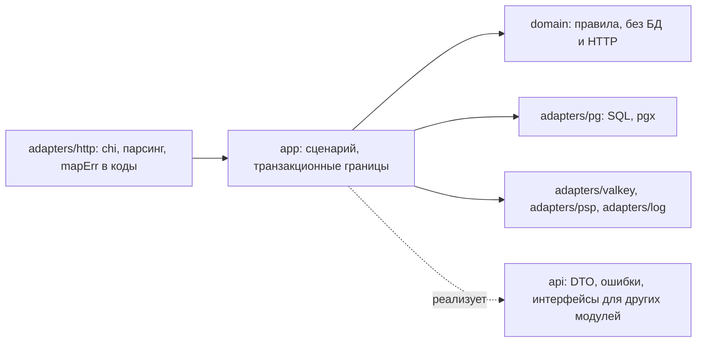

Слой `app` держит транзакционную границу: каждая мутация проходит через `Store.InTx`. Слой `domain` проверяет правила и не знает про БД. Ошибки домена и `api` превращаются в HTTP-коды в одном месте, функция `mapErr` в `adapters/http`.

## 5. Сценарии

### 5.1 Вход в waiting room и проверка допуска

Токен привязан к паре (event, user) и живет `ADMISSION_TTL` (15 минут). Valkey ускоряет проверку, истина лежит в таблице `admissions`.

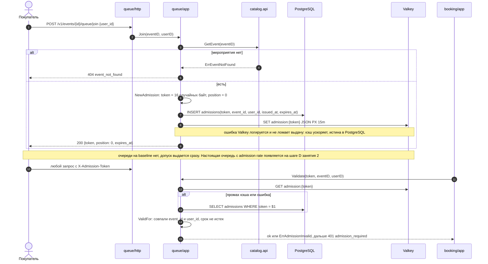

### 5.2 Hold места: два конкурента на одно место

Здесь живет инвариант I1. Гарантию дает partial unique index `uniq_active_hold (event_id, seat_id) WHERE status = 'active'`, advisory-lock только выстраивает конкурентов в очередь до вставки.

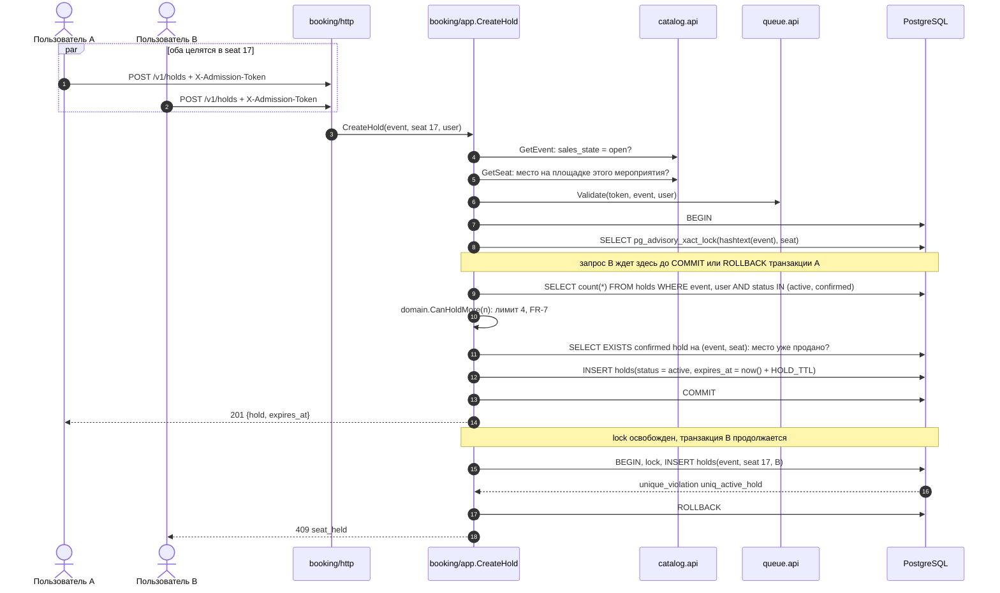

Коды ответа этого сценария: 201 создан, 409 `seat_held` или `seat_sold` или `sales_closed`, 422 `hold_limit` или `seat_not_in_event`, 401 `admission_required`, 503 `db_busy` при исчерпании пула, 503 `timeout` при исчерпании бюджета хендлера.

### 5.3 Заказ: идемпотентность по ключу

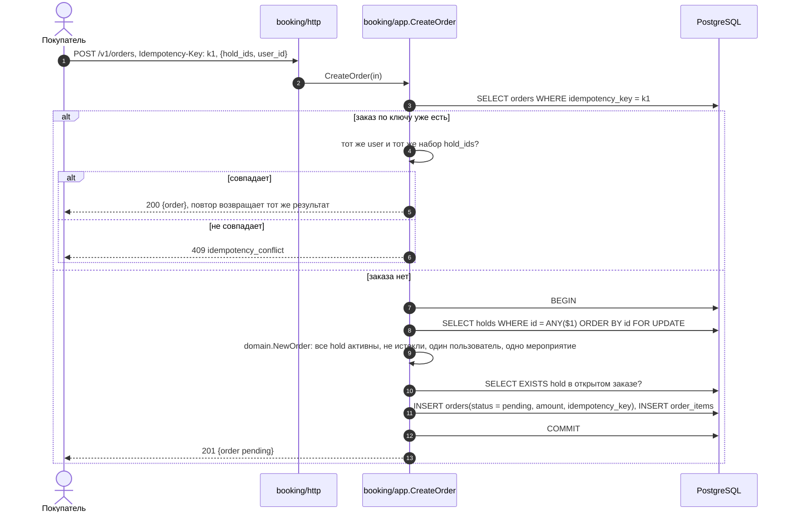

Сортировка `ORDER BY id` при блокировке строк убирает взаимные блокировки двух заказов с пересекающимися hold. Гонку двух одинаковых запросов ловит `orders.idempotency_key UNIQUE`: проигравший перечитывает заказ победителя и отдает 200.

### 5.4 Оплата: списание, подтверждение, билет, уведомление

Весь путь синхронный. Четыре шага в четырех транзакциях, между ними внешний вызов PSP.

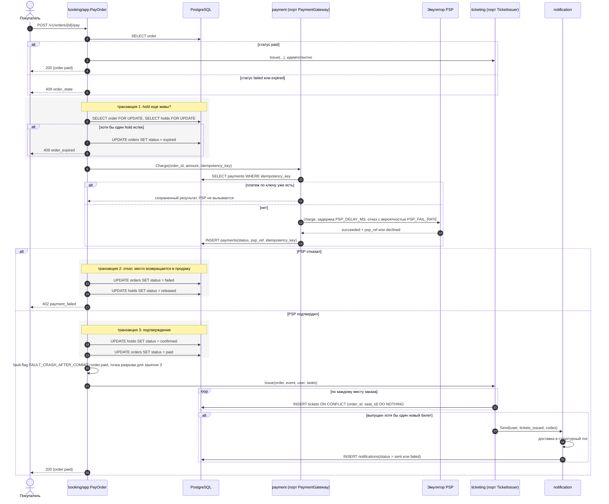

Два известных разрыва этой цепочки, оба намеренные:

- падение процесса между транзакцией 3 и выпуском билета оставляет оплаченный заказ без билета, то есть нарушает I3. Повторный `pay` чинит ситуацию, `Issue` идемпотентен по `(order_id, seat_id)`. На занятии 3 шаги выпуска и уведомления уезжают в outbox.
- если hold нельзя подтвердить после успешного списания, деньги списаны и место потеряно. Сейчас это пишется в лог как требующее компенсации, заказ помечается `failed`. Компенсация появляется на занятии 7 вместе с сагой.

### 5.5 Истечение hold

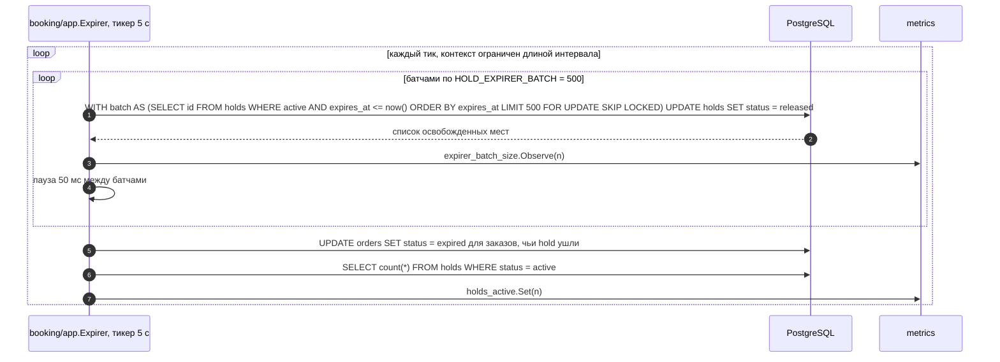

`SKIP LOCKED` и батчи выбраны по результату замера: один большой `UPDATE` под штормом давал всплеск p99 ровно в момент замера. Параллельные `pay` и `release` при этом не блокируются.

### 5.6 Карта зала

Самый тяжелый запрос baseline: 40 000 мест сериализуются целиком на каждый вызов, около 1.8 МБ ответа.

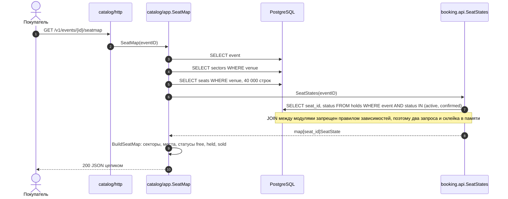

### 5.7 Билеты пользователя

Чтение через границу модулей: `ticketing` не владеет заказами и берет их через `booking.api`.

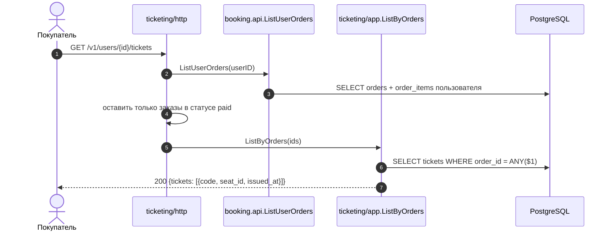

### 5.8 Запуск и остановка процесса

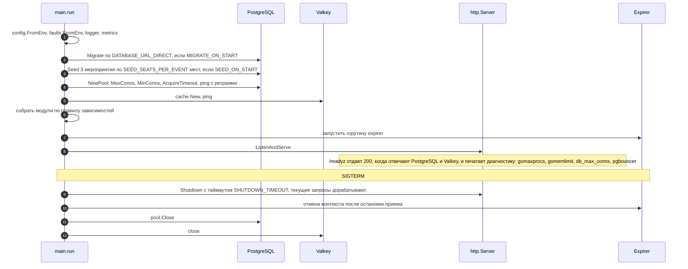

Порядок остановки выбран так, чтобы expirer не выключился раньше, чем дорабатывают запросы: сначала перестаем принимать новое, затем гасим фон.

## 6. Данные и инварианты

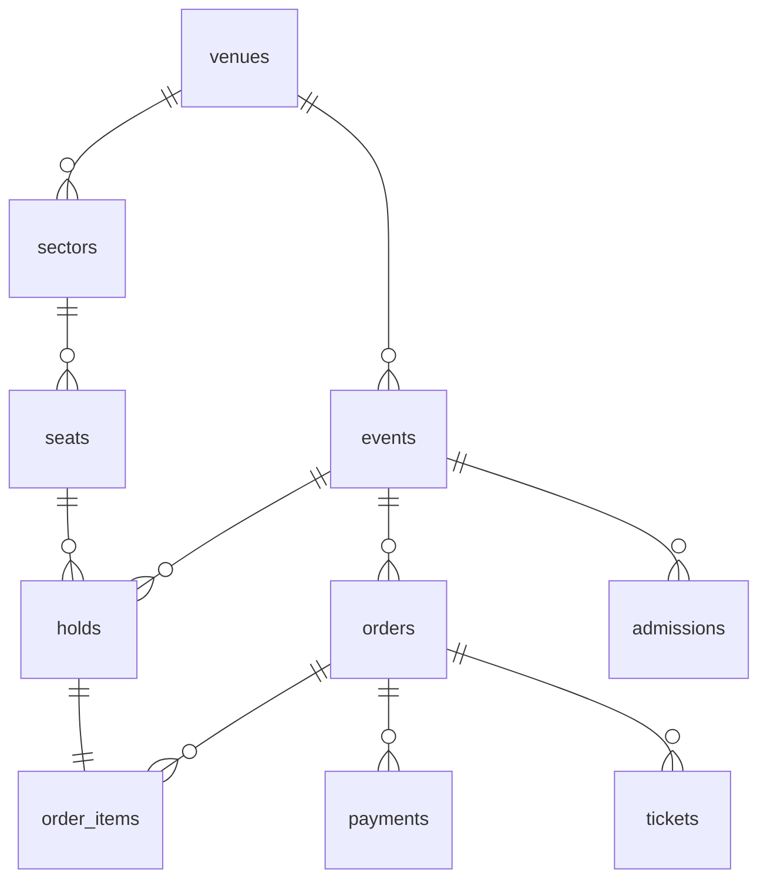

| Инвариант | Формулировка | Чем обеспечен |
|---|---|---|
| I1 | на `(event, seat)` не более одного активного hold | `uniq_active_hold (event_id, seat_id) WHERE status = 'active'` плюс `pg_advisory_xact_lock` до вставки |
| I2 | на `(event, seat)` не более одного билета | проверка `SeatSold` в транзакции hold, `tickets_order_seat_uniq`, `tickets.code UNIQUE` |
| I3 | у каждого `paid` заказа есть билет на каждую позицию | синхронный вызов `Issue` внутри `pay`, идемпотентный повтор при повторном `pay` |
| I4 | не более 4 билетов на пользователя на мероприятие | `CountUserHolds` и `domain.CanHoldMore` внутри транзакции hold |

Идемпотентность держится на уникальных ключах: `orders.idempotency_key`, `payments.idempotency_key`, `tickets (order_id, seat_id)`. Проверяет все это `tools/invariant-checker` (`make invariants`) по данным PostgreSQL после каждого прогона нагрузки.

## 7. Бюджет запроса и таймауты

| Уровень | Параметр | Значение | Что происходит при исчерпании |
|---|---|---|---|
| HTTP-сервер | `ReadHeaderTimeout` / `ReadTimeout` / `WriteTimeout` / `IdleTimeout` | 5 с / 10 с / 15 с / 60 с | соединение закрывается |
| Хендлер | `HANDLER_TIMEOUT` | 3 с | 503 `timeout` |
| Пул pgx | `DB_ACQUIRE_TIMEOUT` | 2 с | 503 `db_busy` плюс `Retry-After`, счетчик `db_pool_acquire_timeouts_total` |
| Пул pgx | `DB_MAX_CONNS` / `DB_MIN_CONNS` | 200 на baseline, 40 с шага A / 5 | очередь за соединением живет в приложении |
| PostgreSQL | `statement_timeout`, `idle_in_transaction_session_timeout` | 5 с | запрос снимается сервером БД |
| PgBouncer | `default_pool_size`, `query_wait_timeout` | 20, 5 с | клиент ждет серверное соединение |
| Домен | `HOLD_TTL`, `ADMISSION_TTL` | 10 мин, 15 мин | hold освобождается expirer, токен истекает |
| Процесс | `SHUTDOWN_TIMEOUT` | 10 с | принудительная остановка сервера |

Каждый уровень ниже быстрее уровня выше: хендлер сдается раньше, чем сервер оборвет запись, а ожидание соединения короче бюджета хендлера. Это дает быстрый отказ вместо зависшего клиента.

## 8. Наблюдаемость

- RED-метрики по маршрутам: `http_requests_total`, `http_request_duration_seconds` с меткой шаблона маршрута chi.
- База: `db_query_duration_seconds` по имени запроса (имя берется из комментария `/* booking.lock_seat */` в начале SQL), `db_pool_acquire_wait_seconds`, `db_pool_acquire_timeouts_total`.
- Домен: `holds_active`, `expirer_batch_size`, `hold_contention_total`.
- Логи структурные (slog), в каждом запросе `request_id` от chi.
- Профили: `/debug/pprof` с продленным дедлайном записи, Alloy тянет CPU, heap и goroutine каждые 15 с в Pyroscope.
- Готовность: `/readyz` проверяет PostgreSQL и Valkey и печатает `gomaxprocs`, `gomemlimit`, `db_max_conns`, версию PgBouncer.

Метрики `cache_ops_total`, `eventbus_published_total`, `eventbus_dropped_total`, `eventbus_queue_depth` уже объявлены и наполняются начиная с шага B.

## 9. Что baseline делает плохо и куда это чинится

| Слабое место baseline | Проявление под штормом | Где чинится |
|---|---|---|
| карта зала целиком на каждый запрос | `catalog.seats_by_venue` 102 мс на вызов, 68 % CPU приложения на сборке ответа | шаг B: карта по секторам, проекция, версионированный кэш в Valkey, ETag |
| нет индексов под лимит 4, expirer и статусы мест | Seq Scan по `holds`, `count_user_holds` 3 мс на вызов | шаг A: `CREATE INDEX CONCURRENTLY` в миграциях 0006-0010 |
| пул 200 соединений при `max_connections = 100` | 503 `db_busy`, в прошлых прогонах `too many clients` | шаг A: пул 40, PgBouncer в transaction pooling |
| advisory-lock на горячем ряду | сотни сессий с `wait_event = advisory`, p99 hold 1.7 с | шаг C: `INSERT ... ON CONFLICT DO NOTHING RETURNING` по partial unique index, плюс `POST /v1/holds/any` |
| допуск выдается сразу, очереди нет | весь трафик идет в консистентную часть | шаг D: настоящая очередь и admission rate |
| билет и уведомление выпускаются внутри `pay` | падение после commit теряет билет, I3 нарушается | занятие 3: outbox, CDC, отдельные потребители |
| нет аутентификации и rate limit | боты неотличимы от людей | занятие 8 |

Полные цифры baseline: `lessons/02/baseline.md`. Решение о стартовой архитектуре и список осознанных упрощений: `docs/adr/ADR-001-modular-monolith.md`.
